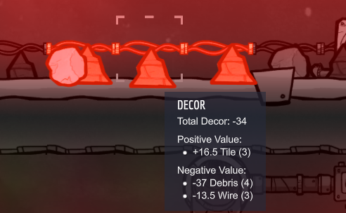

# Sections

* [Dupe Traits](#dupe-traits)
* [Dupe Builds](#dupe-builds)

# Dupe Traits

As mentioned on the [main guide](..), the most important decision you have to make here are regarding your initial traits and stats.  The interests mostly serve as a buff to learning jobs - they're most useful when you _need_ a Dupe to skill up quickly to unlock a special skill, which is a situation you'll only reach after a number of cycles.

## Positives:
* You'll note that many of the traits simply boost a Dupe's starting skill level.  This is a boost past the maximum cap for the stat and directly modifies its base level without slowing down the Dupe's ability to learn that stat; they'll make fantastic specialists in jobs based upon that stat.
* On the other hand, some skills exist with special unique bonuses - one skill allows a Duplicant to use less oxygen, another lowers their Decor requirement, one reduces a Dupe's susceptibility to disease, and another allows Dupes to move through water at standard speed.

## Negatives:
* Some negative skills simply disable jobs.  Personally, a few of these will likely be your best option.
  * Yokel blocks research, but you can only ever use a maximum of two researchers, and I highly recommend restricting yourself to just one.  
  * Cooking isn't high demand, so Gastrophobia's a perfectly fine negative.  
  * Scaredy-cat is fine in small numbers as well - even a single Dupe can take on a Hatch just fine.
* Problematic negatives:
  * The main traits to avoid are **Bottomless Stomach** and **Mouth Breather** - these cause your Dupes to eat too much food or breathe far more oxygen than others, affecting your most critical resources.
  * Loud Sleepers will need a cot separate from where other dupes might sleep - this can easily disrupt your base layout and cause issues with base layout planning as you learn.
  * Small Bladder seems innocuous, but that Dupe's going to need a lot more breaks (and thus, more time wasted running and their waste will increase your overall workload and/or water consumption (once handled with plumbing) a bit.
* Situational negatives:
  * Flatulent disrupts any nearby dupes whenever it triggers, which can disrupt their work.  It also easily messes with any gas management setup you may be going for.  On the other hand, they _do_ produce small amounts of natural gas.
  * Narcoleptic is a bad negative to take for any supply-oriented (high Athletic + Strength) dupe; they'll forget whatever item they were delivering when they take their nap.
  * There are ones that block digging and construction, which I do not recommend for your initial crew, but are easily survivable if the other Dupes are strong in the blocked skill.  Once the game is underway, this is generally no longer a concern.

# Dupe Builds

As of the Occupational Update, Dupes may now specialize through job training.  Furthermore, the Ranching Upgrade Mark 1 has given us the priority system, allowing each Dupe to have a specialized set of priorities - this makes creating Dupe builds far more viable than it was before!  Thinking about Dupe specialization when picking a Dupe will help ensure you keep a well-balanced workforce for your base!

Note that, in general, you should avoid racing a Dupe through their Job skill tree - carefully note how enhanced Jobs will affect expectations and feel free to stop progressing to prevent stress buildup across your base until you can manage it well.  You have a lot of time before most of the high-end jobs become necessary - there's generally more than enough time for job training.

Here is a list of some useful builds to keep in mind when picking a Dupe:

* [Researcher](#researcher)
* [Pioneer](#pioneer)
* [Farmer](#farmer)
* [Sweeper](#sweeper)
* [Supplier](#supplier)

## Researcher

In a standard run, you will likely only need a single researcher, but it's an incredibly important role for developing your base during the early to mid-game.  Research is how you unlock new technologies and buildings and is now also involved with geological analyses of the various Geysers you'll discover as your Pioneers branch out through the map.

This Dupe's natural focus is the Research job line; simply enrolling in the Research Assistant line is enough to allow a Dupe to operate a Super Computer, which is necessary for any technology at or after the second tier.  As such, they should keep Research as their highest priority.  Since they will be the base's research specialist, note that _every other Dupe_ should have a Disabled priority for the Research skill so that the specialist is not blocked from working.

This is also the rare role where I advocate quickly going for at least the second tier of the job as soon as possible, as only the final tier provides the needed buff for analyzing Geysers.

For times when this Dupe is not researching, I'd advise setting a "High" priority for Operate - they'll work other technical machinery and will also prioritize power generation when not busy researching, which can be important for maintaining power to your Research Station if no other Dupes are using your initial Manual Generator(s).  Later in the game, this will help them to "tech up" your base with Metals and Plastics.

Priorities:
* Very High: Research
* High: Operate

## Pioneer

Starting out, you're going to need someone to do a lot of digging, at a minimum.  Often you'll need to dig around obstacles, which may involve (at minimum) building ladders to cross gaps or installing doors to safeguard gas pockets.  As such, this Dupe is a Miner/Architect hybrid designed for exploring your Dupes' asteroid and laying out the initial paths for others to follow.

At the start of the game, this will likely mean specializing your Dupe as an Apprentice Miner.  Instead of continuing on as a Miner, however, you should instantly swap them to Apprentice Architect so that they can more efficiently construct paths for other Dupes.  This has the added benefit of keeping their Job tier (and thus, their expectations) low while your base's infrastructure is low.

Once you reach the mid-game and are expanding your base into neighboring biomes, you'll want to upgrade into a Miner in order to pierce and process Abyssalite.

Priorities:
* Very High:  Dig
* High:  Construction, Supply
* Low:  Operate, Farm, Ranch - these tend to be long tasks that can lock your Pioneer down and prevent them from doing their exploration work.

## Farmer

The second truly pressing issue for a colony (after toilets) is to establish a food supply.  Digging out your base will provide a number of Mealwood Seeds and a few Blossom Seeds, true, but this takes a considerable amount of time and spreads out your initial oxygen supply.  Also, Mealwood isn't a viable long-term solution - it requires constant manual fertilization and is actually a rather high-maintenance plant.

As such, the Farmer's role is important on two fronts:
* They are quicker at managing your initial, likely sizable Mealwood farm.
* They have a bonus to multiplying seeds, very important for weaning yourself off of Mealwood for the early-to-mid-game.

Priorities:
* Very High:  Farm
* Low:  Construction, Operate
* Low or Disabled:  Dig (which would take them far from base and the farm)

It's not important to rush them into the Farmhand job immediately - the food expectation isn't favorable right at the start, and Gofer can be useful for transporting all of that Dirt to the Mealwood plants.  Only move toward Farmhand once you've gotten a decent Bristle Blossom farm (or the like) in place that can provide quality food to meet the upgraded expectations; it should be a while before you _need_ the second-tier job's specialized station, so you've got plenty of time before the transition is needed.

## Sweeper

As you progress through the early game, you may note that Dupes often take a lot of time running around places.  Dupes with the Gofer Job specialize in carrying heavy loads to reduce the number of these trips that must be taken by other Dupes.

Less obvious, but equally important is the Gofers' role in _cleaning_ your base.  Consider the following image:

{:class="img-responsive"}

Note that each stack of debris is worth -9 points of decor - letting junk pile up around areas your Duplicants stay in is a bad idea for managing stress!  As your Pioneers get to work on making space for the colony, equally important is setting up a Dupe to clean the debris from areas you are converting into dedicated rooms that other Dupes might frequent - like your Barracks/bedroom, research room, and the Latrine/bathroom.  This is where the hybrid Gofer/Groundskeeper - the "Sweeper" - shines.  The Gofer and Courier bonus to carrying capacity allows for _much_ quicker removal of debris as well as quicker resource delivery for any ongoing construction.

Accordingly, I advise fully embracing this role of the Gofer and cross-training them as Groundskeepers - this raises their Strength to enhance Tidy tasks, which _also_ enhances their carrying capacity.  The early-to-midgame lacks sufficient work for a purely-dedicated Tidy dupe, so folding in said tasks into a cross-trained Gofer makes sense due to this synergy.  There's also the little fact that for mopping tasks, whatever is mopped (Tidy errand) turns into bottles that must be carried (Supply errand) away.

Priorities:
* Very High: Operate, Tidy, Storage, Life Support
* Low: Dig, Construct.  Don't disable these outright, but their priority should be shuttling resources.

## Supplier

A good look at the job chart will quickly showcase the usefulness of a hybrid Gofer/Engineer build.  Conveyor belts can only be built by a Dupe that has cross-trained in both Job lines, which will take a considerable time investment to facilitate.  Fortunately, it's also a fairly useful early-game build as well.

Whereas the Sweeper suggested above is oriented toward handling debris that interferes with the base, the Supplier is more oriented toward ensuring the base stays up and running.  As mentioned before with the Sweeper, Gofer and Courier dramatically help increase a Dupe's carrying capacity - this is useful for quicker deliveries of important materials to farms, Coal Generators, Algae Deoxidizers and Terrariums, and more.  Meanwhile, the Engineer job helps facilitate a Dupe's ability to ensure the base obtains enough electrical energy to keep all the machines operational; after all, electricity is another important resource for the base.  At the start of the game when all you have is Manual Generators, having a Dupe set to Very High priority for Operate is therefore very useful.

Keeping in mind that the end-goal of this Dupe is to unlock resource logistics through constructing conveyor belts and the like, it's useful to devote some time to ranking up this Dupe's Architect skill as well.  Aim to do this when your base is more or less stable and not in need of sweeping tasks.

Early-game Priorities:
* Very High:  Supply, Operate
* Low: Construction, Dig.

As your base grows, Supply errands can rapidly pile up, so having this Dupe devoted full-time to Supply tasks for the early game is quite reasonable.

Late-game Priorities:
* Very High:  Supply
* High: Operate, Construction
* Low: Dig.
