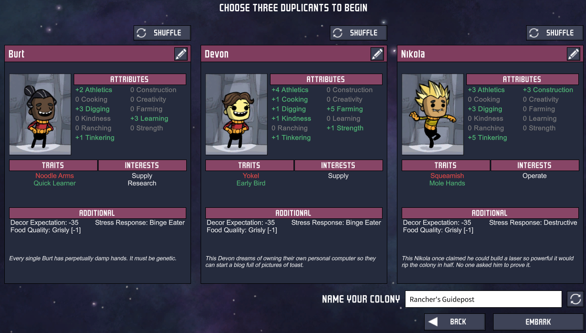
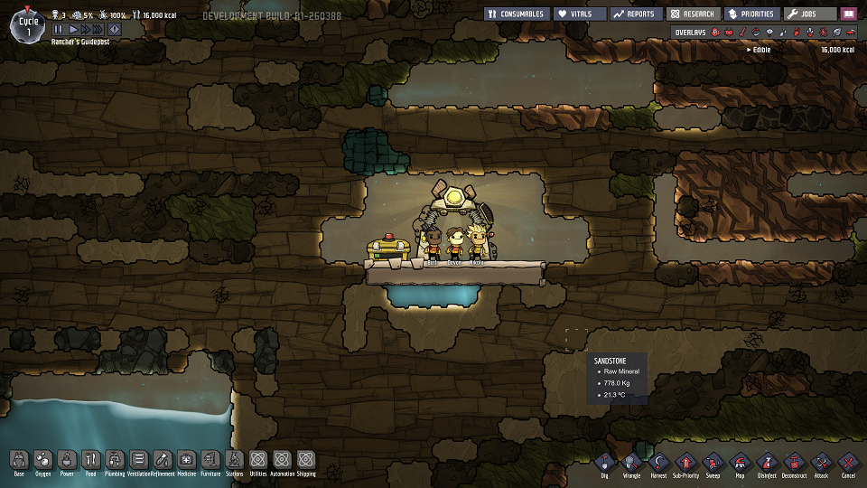
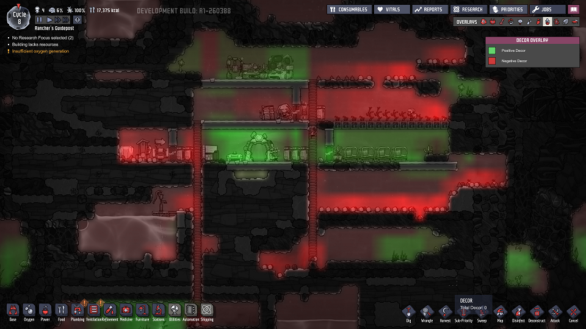

# Sections

* [Assembling Your Crew](#assembling-your-crew) - picking a good initial set of Dupes.
* [A New World](#a-new-world) - how to survive the early game.
  * [What Do I Have?](#what-do-i-have)
  * [What Do I Need?](#what-do-i-need)
  * [Sanitation](#sanitation)
  * [Critical Storage](#critical-storage)
  * [Research, Jobs, and Oxygen Production](#research-jobs-and-oxygen-production)
  * [Careful Dupe Selection](#careful-dupe-selection)
  * [Farming, Foraging, and Cooking](#farming-foraging-and-cooking)
  * [Stress Mitigation](#stress-mitigation)
* Setting Up Base - transitioning to the mid-game.
* An Eye Toward Expansion

First off, don't be afraid to just dive into the game and try things out for a couple of games first.  There's a lot to take in, and a lot of the game's appeal is in exploration and discovery - both in terms of game mechanics and your Dupes' world.  Oh, and "Dupe"?  "Dupe" is shorthand for "Duplicant," the race of your adorable little crew members in this game.

If you wish to follow along with this guide, I'll be basing everything on a run using the world-gen seed `966355023`.  (Thanks to [this link](https://www.reddit.com/r/Oxygennotincluded/comments/7me2lk/share_your_map_seeds_here/) for the seed.)  It has an extremely convenient setup for learning the game and works with the new Ranching upgrade.

To facilitate browsing and reading, this guide has been split across several pages.  Not that this prevents it from being a wall of text in all places, but it should at least help to reduce that issue significantly.  When in doubt, refer back to the top of this page - the "Sections" section.  There will be a convenient link in the floating section header to facilitate this.

---

# Assembling Your Crew

So, you just got this game and are wondering how to begin, or perhaps, *where* to begin.  What are your important decisions?  What goals should you have?  How should I approach the game?  All are good questions, so let's get to it with the first screen you'll see as you start a game.

{:class="img-responsive"}

Let's get the obvious things out of the way.  

* You get to start the game with three randomly-generated Duplicants.  As the game progresses, you'll get the opportunity to gain more of them, but at the start of the game you have a special opportunity - you can infinitely re-roll your generated Duplicants individually to custom-tailor your starting team.  Once the game proper begins, this ability is lost to you, so feel free to take some time looking for the ideal crew - you'll have to rely on favorable random-generation later!

* Each Dupe has a unique set of traits and interests.  While the other details can matter in the long run, if you manage your base well they should have little impact on your game until your run ends.

A few less-obvious things to note:

* The most important decision you have to make here are regarding your initial traits and stats.  The interests mostly serve as a buff to learning jobs - they're most useful when you _need_ a Dupe to skill up quickly to unlock a special skill, which is a situation you'll only reach after a number of cycles.  Instead, traits are the most important factor in selecting a Dupe - pay careful attention to any traits that affect a Dupe's food or oxygen consumption before selecting them!  For a more in-depth analysis, check out the [Dupe Traits sub-guide](dupe-builds#dupe-traits).

* Some stats are not particularly important until later in the game:
  * Tinkering - this affects manually-operated machines.  It'll take a while for this to become particularly relevant.
  * Creativity - this affects your ability to lower stress through base decor.  Artists are great, but all you need is a +4 to Creativity to make masterpiece paintings - fairly easily obtainable from a +2 Dupe after Job selection.  Those aren't terribly uncommon.
  * Ranching - this only becomes practical after you have established a sustainable farm, as it requires a second-tier job and a third-tier research to be of _any_ use.  It's definitely a nice skill, but it's useless when starting out.
  * Kindness - this matters when you start breaking into the Toxic (slime-filled) biome.

* If possible, I advise picking duplicants for the following roles/[builds](dupe-builds#dupe-builds), prioritized from most to least important:
  * A ["Researcher"](dupe-builds#researcher) - someone with a high learning stat and without Small Bladder.  You have to unlock everything interesting in ONI.
  * A ["Farmer"](dupe-builds#farmer) - someone who can efficiently manage your colony's food and plants.  Multiplying seeds is important.
  * A ["Pioneer"](dupe-builds#pioneer) (Miner/Architect) - a great digger who can clear out early space for your base.  All the better if they can construct well.
  * A ["Sweeper"](dupe-builds#sweeper) (Gofer/Groundskeeper) - a dupe who can efficiently shuttle around your colony's material resources.

* You may have noticed that I've listed more than three priorities above, despite you only being able to select three Dupes.  This is intentional, as your initial Dupes will need to put in double-duty by pitching in toward multiple types of tasks to most effectively manage your base.

Here are the dupes I'll be starting this tutorial with:

{:class="img-responsive"}

If you would like a more in-depth discussion of overall Dupe selection, check out the [Dupe Builds sub-guide](dupe-builds)!

[Return to the Table of Contents](#sections)

---

# A New World

## What Do I Have?

{:class="img-responsive"}

First reaction:  They lied to us!  Oxygen is *right there*!  There are even some free oxygen sources at the top-left of our base!

While that may be true, your Dupes have this nasty little habit.  They breathe, and when they breathe, it uses that oxygen up.  The Oxylite blocks (the teal bricks to the top-left of the Dupes) the game starts you out with will last you probably 5 or so cycles.  There's no need to panic too quickly, but after that it's up to you to ensure your Dupes have enough air.  So, what do we have to start?

* Three Dupes 
* 16,000 kcal of food (A bit over 5 days of food for three dupes)
* Starting oxygen (probably good for around 5 - 7 days with three dupes)
* A gate with a pretty light show.
  * More seriously, this gate is your base's initial center, and every three days it will offer you the selection of 1 of 3 new dupes that you **may** add to your growing colony.  Note, "**may**."  You have the option of denying all of them entry, and I highly advise you make use of that from time to time... probably more often than not.  Learning to manage your colony's size is a very important part of the game, and the game's difficulty increases with your Dupe count, as it affects your core Oxygen and food consumption rates.
  * It is no coincidence that your starting food is right by the gate; the gate provides a lot of decor that helps reduce early stress, so having your Dupes eat right by the gate is a helpful default behavior while you work on other matters.
* Not much initial free space.  The good news is, you can dig out the entirety of your initial biome with ease!
* The ability to build the following as soon as you mine your first blocks:
  * Ladders
  * Basic Tiles
  * Storage Compactors
  * Outhouses
  * Cots

You can also build a few other things - just check out your build menu in the bottom left!  You have to have the required resources first, of course.

Rather than give an absolute step-by-step breakdown, I'll assume you're a competent gamer and can do some basic mining and exploration.  I mean, this game is pre-release and you've taken the time to purchase it and play, right?  I'm sure you can figure out the basic controls and a few other things.

## What Do I Need?

The key to understanding ONI is to recognize that it's a game about resource management and managing overall priorities.  Nearly every solution introduces a new problem of sorts; the fun of ONI is learning to juggle these problems and using them to solve each other.

As you might guess from the game's initial tooltips, your first priority should be sanitation.  But what comes after that?

My general set of priorities when starting a new game:

1.  [Sanitation](#sanitation)
2.  [Critical Storage](#critical-storage)
3.  [Research, Jobs, and Oxygen Production](#research-jobs-and-oxygen-production)
4.  [Careful Dupe Selection](#careful-dupe-selection)
5.  [Farming, Foraging, and Cooking](#farming-foraging-and-cooking)
6.  [Stress Mitigation](#stress-mitigation)

Addressing each of these will make your base relatively stable for the first fifty cycles as long as you don't raise your Dupe count too high.

---

# Sanitation

You see, there are some things your Dupes can handle just fine, and others that they... can't.  Or maybe it's more of a "won't," really, but let's not be too particular - it's up to you to ensure some things are kept at bay.  The first of these:  like people, your Dupes need themselves a good ol' fashioned bio break every once in a while.  This generally occurs once a day per Dupe.

As a result, you've got a little over **one cycle** (in-game day, which is 600 seconds in real-time) to prepare for this before they leave wonderful little polluted-water messes all over the floor.  That is, if you didn't take someone with Small Bladder - then you have even less time!  As you may imagine, Dupes are not exactly fond of mopping up "accidents"... though they will actually bother if directly instructed to do so.  As of the Outbreak update, there's another issue to consider - with biological waste comes germs, and you don't want those to spread freely!

As such, our approach is two-fold:

1.  Find and tap an initial water source.
2.  Establish an isolated 'outhouse'.

What you want to construct will look something like the following:

{:class="img-responsive"}

Note that the only way into the rest of the base is through the Wash Basin.  That way, a Dupe will be forced to wash their hands after utilizing the restroom, preventing the germs from escaping into the rest of the base.  As your base grows, make sure to avoid any chance of a Dupe being unable to wash their hands when they leave the Lavatory room due to Wash Basin unavailability caused by another Dupe!

Of course, to get that Wash Basin up and running requires water - accordingly, your first task is to build a Pitcher Pump on an existing reservoir of fresh Water for use by the Wash Basin.

---

# Critical Storage

At the same time, I usually try to set up my initial storage for critical resources.  The reason - Hatches.

{:class="img-responsive"}

These little creatures like to consume random debris and produce Coal.  This is generally a good thing for your base, but they're rather indiscriminant in what they'll eat.  If you give them the chance, they may consume critical resources like food and Algae!  Accordingly, I tend to rapidly establish Storage Compactors to store the following:

* Algae, random Seeds
  * Once you establish a good initial farm, Algae will become your most critical resource until you transition into the mid-game.
* Raw Metal (Copper)
  * While the seed used by this guide has plentiful Copper supplies, this is not the case on every map.  As the game progresses, you'll need a lot of metal, and you're basically limited to what you can get in your initial zone for this resource.  Copper has unique properties, so don't squander it!

I also make sure to set the initial Ration Box to accept Muckroot as soon as possible so that Hatches can't access any that drops during my initial base setup efforts.

After accomplishing these first two steps and preparing for the next, my base looks like this:

{:class="img-responsive"}

---

# Research, Jobs, and Oxygen Production

Now that you've established somewhere for Dupes to "do their business," it's time to establish somewhere for Dupes to do their actual work.  The vast majority of buildings in ONI make use of electrical power to function or produce electrical power... but most of the buildings are presently locked - even the Jobs Board!  Accordingly, it's time to rectify that issue.

Your initial setup should consist of the following:

* One Manual Generator
* One Tiny Battery
* One Research Station
* The wiring necessary to connect the pieces.

You'll need to mine enough Copper Ore to make this happen, of course, so dig toward wherever is most convenient for you.

For my version of this base, here's the setup I established:

{:class="img-responsive"}

{:class="img-responsive"}

Note that wires build on a separate layer than tiles and buildings; you can hide them behind tiles to promote a prettier base!  However, you _cannot_ hide them behind unmined resources.

Once you've established your initial workshop, make the following researches your priority, in order:

* Advanced Research
  * This unlocks the Jobs Board, which can grant your Dupes some quick stat buffs while leveling up their abilities.
* Basic Farming
  * This is necessary to establish your first farm, for Mealwood.
* Power Regulation
  * This unlocks the standard Battery, which has four times the capacity of your Tiny Battery.  This means longer intervals between power generation runs and can help ensure oxygen production continues at night later on.

Around this time you may notice that your initial Oxylite reserves are mostly gone; you'll soon need to start producing your own Oxygen!  Fortunately, we just got done setting up our initial workshop, and the observant reader may have noticed a stray wire to the right of the bottom floor in my initial design.  What's that for, you ask?  This slot was designed to take an Algae Deoxidizer, our first Oxygen production building.  It constantly consumes power when producing, but allows us to produce Oxygen where we want it.  I have a layout planned ahead - this lies along a vertical corridor in the eventual base, so it makes a good place for passively distributing the produced Oxygen - especially once we unlock Airflow Tiles later on.

So, be sure to add the following to your workshop somewhere:
* Algae Deoxidizer.

Once you start Oxygen production, you'll want to watch your Algae levels regularly.  When they get low, make sure to keep an eye out for new sources that you can mine and place into storage for later!

---

Here's the new look of my base after unlocking the Jobs Board:

{:class="img-responsive"}

As a reminder of my initial crew:

{:class="img-responsive"}

For my starter Duplicants, I assigned the following Jobs:

* Burt became my Assistant Researcher.  It's one of his interests and he has a decent initial Learning skill.
* Devon is following my ["Sweeper" build](dupe-builds#sweeper), so I assigned her to the Gofer role.  She also has a high Farming stat, so she might be swapped over completely to a Farmer at a later point.  We've a lot to sweep at the moment, but less to plant - so no harm, no foul.
* Nikola is following my ["Pioneer" build](dupe-builds#pioneer) build at present.  That being stated, he's actually pretty suitable for an eventual ["Supplier" build](dupe-builds#supplier), but that will only factor in later.

---

# Careful Dupe Selection

Around this time you'll likely be presented with your first random Dupe selection option, such as the following:

{:class="img-responsive"}

Here, I got a pretty decent offering, though none of them is truly outstanding.  That being said, a value of 5 is fairly high for an initial stat, and we want to get a Farm going pretty soon.  Since Devon is similar but has better Supplier stats, I chose Travaldo here - he'll be devoted to the ["Farmer" build](dupe-builds#farmer), rounding out the four initial Dupe selection priorities I mentioned before.

It does somewhat hurt to not take Frankie due to that pretty decent Cooking stat, but why take an Anemic Dupe when Travaldo's just about as good for the base and has a much lower impact negative trait?

If none of the Dupes look good for your base, I highly encourage you to "Reject All" - you should be doing this more often than not, especially while learning.  That said, it does help to at least get a fourth Dupe to help manage tasks fairly early.

---

# Farming, Foraging, and Cooking

Something else you've likely noticed around this time - that "Calories Available" count at the top-left is dropping.  Now that we can research basic Farming structures, it's time to build our first farm!  However, you may be missing something important for your first farm - seeds!

When looking for seeds, as well as random Muckroots that may be lying around, you want to look for the following mark on a resource tile:

{:class="img-responsive"}

The more of these you can find in one place the better.  I've included a full screenshot to show where this is in relation to my base - it's nice and close, so digging these objects out could double with gaining more space to expand my base into - it's a win-win!  Additionally, consider digging up any already-growing plants you can find - if their progress is below 70%, it'll be faster to uproot and replant them than to wait for their first crop before uprooting them!

As a note on Mealwood, your first crop:

* Each cultivated Mealwood plant takes 3 cycles to produce a 600 kcal crop.
* Your Dupes (without Bottomless Stomach) consume 1000 kcal a cycle.
* Therefore, ideally you should have 5 Mealwood plants per Dupe.
  * We can bring this number down a bit by cooking the resulting Meal Lice using the Microbe Musher, bringing it quite close to 4 plants per Dupe.
* With a good Farming dupe (like Travaldo), it is possible to settle for less plants initially; they have a nice bonus Seed chance that will facilitate creating the seeds you are missing over time.

As you establish your farm, make sure to access the Consumables menu and disallow eating of Meal Lice.  After your first harvest of Meal Lice, whatever the source, I also advise setting your Ration Box to accept them into storage, especially if the plants are accessible by Hatches.

Here's what my base ended up looking like after a few foraging runs and establishing the first farm:

{:class="img-responsive"}

I personally went ahead and researched Meal Preparation, the second-tier farming research - you'll note that many of the farming plots are not in Planter Boxes but are instead in Farm Tiles.  I plan to convert the Planter Boxes over to Farm Tiles after the first harvest; Mealwood can grow efficiently in a very compact space, which I like to make advantage of.  Thinking long-term, your space is quite valuable within your initial biome, as everywhere else requires some significant terraforming efforts.  But that's a topic for later.

You may also notice that I have a couple of Dig errands queued up in the Dupe workshop - that's where I plan to place my initial Microbe Musher.  

Benefits:
* The Microbe Musher allows you to add +500 kcal for every two Meal Lice harvests you get, allowing you to extend your initial food supply nicely.
* In the case your food stores become dire, you can make Mush Bars as a stop-gap.
* Liceloaf has a heavily-reduced mass for easier storage and refreshes the freshness timer completely.

Cons:
* It consumes precious Water.  It may not seem precious now, but it becomes a major issue in the mid-game.

---

# Stress Mitigation

Now that we have systems in place to take care of the three most critical issues - hygiene, oxygen, and food - it's time to address the fourth - stress.  This is best addressed through enhancing your base's Decor values to provide a nice "shelter" for them.  When Decor expectations are met, stress is lowered - and vice-versa.

My best advice here is to consider the following principles:

* Where do your Dupes spend most of their time?  Raising the Decor here will have the most impact.
* Subsequently, where do you want your Dupes to spend most of their time?  Drawing your Dupes to specific locations allows Decor there to be highly effective.

Some common areas of a base that are wise to enhance:

{:class="img-responsive"}

* The Barracks room.  Every in-game night, your Dupes spend a full 1/8th of a cycle sleeping.  Why not establish a Barracks room and decorate that?
  * Extra benefit:  Establishing a proper Barracks "room," as defined by ONI, also increases your Dupes' stamina recovery rate, helping reduce their need for sleep if they make it to bed late!

{:class="img-responsive"}

* The Lavatory room.  Every cycle, your Dupes need to use an Outhouse or Toilet, which takes a little while for each Dupe.
  * Extra benefit:  Fulfilling the requirements for a Lavatory provides a long-term -5% stress buff to any Dupe who visits a Lavatory!

* The Mess Hall room.  Every two cycles, your Dupes need to eat... and you'll note that they take their time doing so.  
  * Extra benefit:  Creating a proper Mess Hall provides a long-term -15% stress buff if your Dupe eats there!

* Your workshop.  You'll note that a Researcher spends a lot of time standing in one place... and also has a more demanding set of expectations.  Making sure his workstation has acceptable Decor is quite important.  As your base grows, likewise for your Cook.

For each formal ONI room, make sure to check the Room overlay to see the requirements necessary to gain a buff!

Even for places that don't get special buffs, giving them high Decor can provide great value in reducing stress.  How can we accomplish this?

* The number one rule in raising decor - remove all debris!

{:class="img-responsive"}

Each individual stack of debris costs -9 decor in an area around it - and each debris stack can only represent one resource!  If you've been doing big digs, it's easy to go -63 decor from this!

As a result, you'll want to sweep all of the rooms listed above that you actively maintain.  If you don't bother with a Mess Hall, be sure to at least sweep the area by your starting Gate!

* When possible, hide wires!

You'll note that the basic Wire has its own Decor debuff.  This only takes effect when the wire is visible to a Dupe, though, so aim to keep Wires hidden behind Tiles and walls so that Decor is minimally affected.  Recall again the initial workshop wiring diagram:

{:class="img-responsive"}

Note how the wires were hidden as much as possible - this rule is why!  I also plan to later add a door and a wall overlaying the exposed vertical wire, further reducing the Decor impact there.  This is also part of the reason for the empty space near the ladders in my current base design.

* Make decorations!

While in limited supply, in the early game you usually have a few Briar Seeds available.  Consider planting them in important places, as they provide a nice, wide Decor buff.  This requires the tier 1 research "Interior Decor," which also makes lighting available.  However, lighting requires power _and_ generates heat - a major mid/late-game issue.

As you progress in the game, make sure to acquire at least one Dupe with Creativity of at least +2.  Once given the Artist job, they can create Masterpiece Portraits (from Blank Canvases) that provide a powerful +20 Decor buff in a radius of 6 - and this buff is per portrait and _stackable_!  Sculptures provide an even wider-range buff!  These provide the tools necessary to meet even the most haughty Dupe's Decor expectations!  Note that building the base for each requires the tier 2 research "Artistic Expression."

Judicious use of these three strategies and careful management of Dupe errands (avoid getting them wet too often in a short timespan) goes a long way in keeping each Dupe's stress levels in check, especially in the early game.  I've made a game lasting through Cycle 128 that has never seen a Massage Table even be built, let alone needed and used.  Proactive stress management is a powerful tool for avoiding greater issues.

{:class="img-responsive"}

While I haven't yet gotten that Creativity Dupe I want, note that I've still been able to make three of the four important areas high enough Decor for early game to reduce Dupe stress and keep it in check; stress levels had risen significantly before the current cycle but are already dropping significantly!  (Green = good Decor, Red = bad Decor)

---

# A New World - Conclusion

Applying all of these strategies has given us a decently sustainable base to build upon - all of the fundamentals for each Dupe are taken care of, giving us plenty of flexibility to move forward and tech up our base.

[Return to the Table of Contents](#sections)