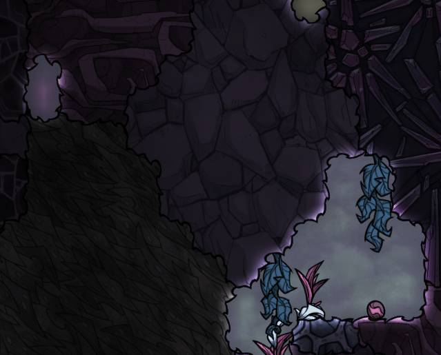
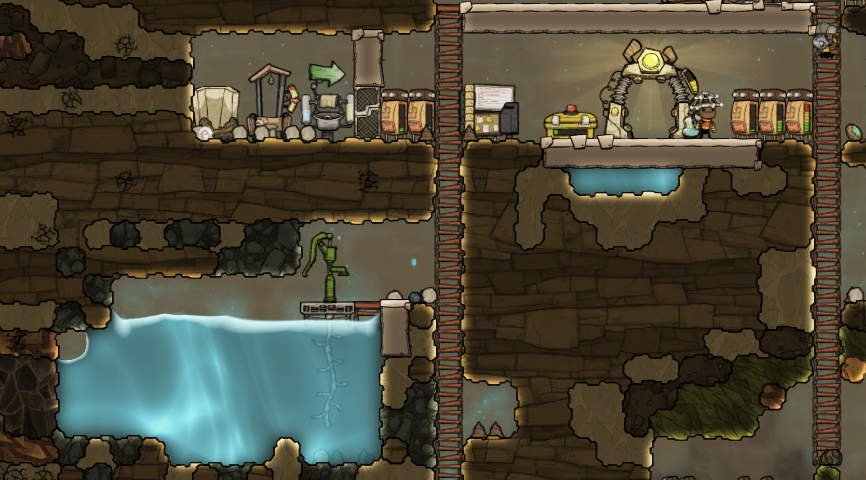
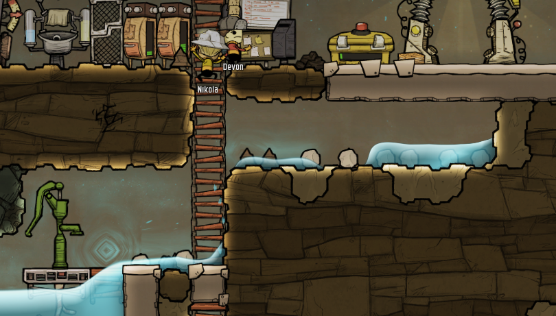

# Sections
* [Long-Term Survival Issues](#long-term-survival-issues)
  * [Heat](#heat)
  * [Water](#water)
  * [Power vs Time](#power-vs-time)
  * [Space](#space)
    * [The Swamp Biome](#the-swamp-biome)
    * [The Caustic Biome](#the-caustic-biome)
* [Moving to the Midgame](#moving-to-the-midgame)

# Long-Term Survival Issues

The previous part of the guide titled ["A New World"](./#a-new-world) established all the basic principles necessary for a base to achieve relative stability for about 50 or cycles.  Without addressing any new issues, you will have plenty of time to experiment with random aspects of the game and test out your own designs, so feel free to do so!

However, to push beyond this point toward long-term survival requires planning for and managing four new critical issues for your base:

* Heat
* Water
* Power vs Time
* Space

You probably won't experience problems with these issues at Cycle 10 or Cycle 20, but what you do now can largely affect the urgency of these issues for your base come Cycle 100, if not Cycle 60.

## Heat

You've probably noticed that the game reports a temperature for _everything_.  Oxygen, Sandstone, and even your Dupes if you bother to check their body temperature.  Speaking of which, as you move into new biomes in the game, some are so hot or cold that they can give your Dupes heat stroke or hypothermia from overexposure over time!

This being stated, the following are the two largest impacts that Heat is likely to have on your base:

* Farming
    - Every farmable plant has a preferred temperature zone for growth.  Too hot or cold, and the plants won't grow.
    - This varies per plant, so be sure to check out the requirements for any farm you go to build!
* Machinery
    - Nearly every piece of machinery generates heat - too much of it, and your machinery will become damaged over time from overheating!

The game simulates heat transfer over time; an area of your base that starts off nice and cool for Mealwood and Bristle Blossom farming may not always stay that way!  Be careful to keep major sources of heat away from your farms!

One of the unintuitive aspects of this game is that thermodynamics isn't always perfectly preserved - as an example, Electrolyzers always produce their output gases at 70 C, regardless of the input temperature, while Water Sieves output clean Water at 40 C.  Make sure to read up on any machinery converting one resource to another for any similar behavior that could dramatically affect your base!

## Water

Another critical aspect of the game is water resource management; your initial supplies of clean water may be large, but they are also finite.  Furthermore, as you continue to unlock Researches, you may notice that research itself consumes quite a quantity of water!  Likewise for Liceloaf - each batch requires 50 kg Water!  Furthermore, you will likely need to swap from Algae-based Oxygen production to Water-based Oxygen production with Electrolyzers, which provides a critical link between your Water supplies and your Oxygen supplies.  Finally, Water is also needed to run Carbon Skimmers, which are the only practical way to remove Carbon Dioxide outright from your base until the late-game!  Strive to make sure you keep enough Water around to keep your base alive and thriving; either this or Heat will generally be your most pressing issue for a long time.

Unfortunately, the quantity of Water at your disposal is hardly the only issue you'll face moving forward.  As you begin to automate your sanitation needs via plumbing, Lavatories, and Sinks, you'll note that your sanitation system outputs contaminated Polluted Water; Water Sieves will do nothing to disinfect the water!  Fortunately, the Electric Grill (the higher-tier Food preparation building) disinfects Food during cooking, but other potential uses of your water supply could pose problems, such as if Slimelung got into your Electrolyzer's Water supply.

Furthermore, note that liquid resources tend to have the highest in-game density when utilized in your base.  As such, the heat (or cold) that your Water and Polluted Water reserves hold tends to affect neighboring parts of the base.  Even more significant is that any plants that require constant Water/Polluted Water supply will be _greatly_ affected by their liquid's incoming temperature.  In general, the temperature of a farm's Water supply will _become_ the temperature of that Farm or something very close; focus on your supply's temperature to keep the farm in check!

To emphasize:

> In general, the temperature of a farm's Water supply will _become_ the temperature of that Farm.

Take great care to manage your Water temperature where it matters!

Polluted Water tends to pose two issues:

* It slowly evaporates directly into Polluted Oxygen over time; large concentrations of this can be bad for Duplicant health, especially if they become contaminated with Slimelung.
* Converting it into Water with a Water Sieve produces Water that is too hot for farms that would rely upon it.

## Power vs Time

One of the wonderful aspects of this game is how it facilitates the automation of many different aspects of running your base.  Much of this is, of course, at the cost of Power consumption.  At first, the only Power production you have is through Manual Generators, which trades Duplicant time for Power to facilitate production of various early-game needs.  As you continue in the game, you will unlock more advanced Generators that need only to be supplied with resources to produce Power over time.

The problem?

* These Generators tend to consume potentially-limited resources.
* They generate non-neglible amounts of Heat and produce other, non-desirable byproducts like Carbon Dioxide or Polluted Water.
  - While the Hydrogen generator has no such issue, your Hydrogen supply tends to be quite limited, as you can only renew it if your Dupes consume enough Oxygen for the Electrolyzer to run.
* While having a nice, constantly-running generator set is nice, running Power wires out to the various parts of your base in need of Power can get tedious and/or tricky.
* Before you get Automation up, you can easily waste precious resources if you can't use all of the generated Power!

When you first begin to build in an isolated area, consider running Power buildings off of Manual Generation until you have a greater need for constant Power there.  That said, this does restrict how useful your Dupes can be otherwise, so try to restrict how much this technique is utilized at any given time.  On the other hand, Coal Generation tends to be relatively low-impact, but it does generate considerable Heat.  Try to keep them away from Farms and make sure there's a way for the Carbon Dioxide to escape to your Carbon Skimmer setup somewhere below.  Of course, you _could_ pump the Carbon Dioxide somewhere else, but keep in mind that doing so will consume Power.  There's always a tradeoff to be considered!

While it may be tempting to substantially increase your Duplicant count in order to "do more" within your base, such as having more Dupes around to handle Power generation, this comes at the heavy cost of Oxygen and Food over time; the more Dupes you have, the faster you will have to swap from Algae-based Oxygen production and the sooner you will run into issues with Water.  Old issues and mechanics do not go away; the number of balls you have to juggle only goes up.

## Space

As you progress through the game, you will progressively expand your base to utilize most of your initial biome.  As you do this, take care to position your "Hot" buildings away from your Farms.  Space, or distance, is one of your more powerful tools in keeping critical areas (like your farms) at the correct temperature.  In fact, it can be quite advantageous to put many of those Heat-producing buildings outside of your initial biome.

Either way, the time will come when you must start utilizing areas that initially pose inconvenient problems...

### The Swamp Biome

{:class="img-responsive"}

Pros:
* Its temperature is ideal for your Duplicants and much of your base.
* This biome holds lots of Gold, the best Metal Ore to use for machinery prone to overheating.
* This is where to find Thimble Reeds, the primary material for making Clothing and Exosuits that help when exploring the other biomes.

Cons:
* Has huge quantities of Slime and the germ Slimelung - don't let the latter get into your main base!
  - However, when cleansed, Slime can be transformed into extra Algae!

Other:
* Often has pockets of over-pressurized Polluted Oxygen.  But, with some foresight and planning, these pools can typically be converted into large amounts of (relatively) clean Oxygen for your base!  (All hail the Deodorizer!)

### The Caustic Biome

{:class="img-responsive"}

Pros:
* No germs!
* This biome contains Balm Lilies, which can be used to produce immune-system boosting supplements for your Dupes.
* Contains lots of Chlorine, quite useful for disinfection of solids from the Swamp Biome.
* Contains significant amounts of directly-usable Algae.

Cons:
* Contains no Oxygen - only Hydrogen and Chlorine, which tends to mess with your existing environment management schemes.
* Is too hot for your core Food farms.

* Space between base components helps to buffer the temperature.
* As the base becomes more complex, more space needs to be alloted for automation infrastructure.

---

While other biomes do exist, only the Swamp and Caustic biomes will be on the borders of your base.

# Moving to the Midgame

Now that we've covered the core issues that we must face to proceed further in the game, it's time to actually _do_ something about these issues.  For those of you who like "how-to" lists, here's my suggested approach to tackling these issues, starting where we left off from the [A New World](./#a-new-world) section of this guide.  I'll focus on the main tasks here, though each section will also contain other updates and pointers from how I've managed this guide's base.

I'll explain my decision making with each section and note the critical researches.  If you've already completed them, I advise looking ahead to the next section's needed research before stopping research tasks.

1) [Establish Plumbing](#establish-plumbing)
2) [Bristle Farming](#bristle-farming)

## Establish Plumbing

{:class="img-responsive"}

As you may recall, one of the earliest steps was to establish a basic, hand-pumped water supply.  Before proceeding further, our first goal will be to establish our first round of plumbing, automating a few of the colony's existing needs and setting things up to facilitate a few others shortly afterward.

Required researches:
* Plumbing (Tier 1)
* Sanitation (Tier 2)

Strongly suggested:
* Pressure Management (Tier 2) - unlocks Valves.

Benefits:
* No more manual upkeep for the base's hygiene levels, freeing up Dupe time.
* Jump-starts our base's core plumbing

Costs:
* We start producing infected Polluted Water.
* Dupes must spend a bit more time on Manual Generators than before.  (It's definitely a net time savings, though!)

---

This guide's World Seed has an incredibly-convenient setup for an initial water reservoir from which to establish plumbing.  It's already rather nicely shaped, which will make it simple to formally convert and build the base around down the road.  In case it's not otherwise obvious, I am committing to turn that existing pool into my core pure water reservoir for the base.  Depending on your world's setup, you may wish to swap your location down the line.  If so, as you become more experienced with ONI, try to plan ahead for how you'll transition your plumbing when that time comes.

You may have noticed that I made some "interesting" spacing decisions in the initial portion of the guide, without calling any attention to them.  That is because while the decisions weren't critical, I was preparing ahead for certain construction decisions being made now.  In particular, at least in previous versions of ONI, water pressure becomes a concern when dealing with large pools of water.  Dealing with leaks can get really annoying when constructing proper walls for the reservoir as well, so I took care to leave a two-thick space for reservoir walls down the line.

I've also decided to convert the space immediately under the Printing Pod to be my first plumbed Lavatory room, which will have two Sinks and one Lavatory to start.  You'll note that I'm using valves fairly heavily here - in the case that two or more Dupes are utilizing the facilities, this allows all buildings in the Lavatory to output at the same time without interference.  Without a Liquid Valve, any time two pipes of fluid meet, only one of them is allowed to continue, regardless of the amount of fluid contained!  The same also holds for splitting a pipe two ways - each tick, water will only flow through one pipe, regardless of whether or not available fluid is left to travel the other!

{:class="img-responsive"}

I've decided to make an area to the lower-left of the reservoir the contaminated Polluted Water tank.  To keep the reasoning short, this places it pretty close to that nice Natural Gas Geyser we've already found!  (It's just to the left of the Dusk Cap/mushroom plant you see on the left-hand side.)  I have plans for connecting the two later down the road.  The key idea - _contaminated_ Polluted Water near the Natural Gas Geyser.

Once all the construction is finished, here's what my setup looks like!  The ladders you see remaining in the Lavatory (and the Debris) will be taken care of while I work on the next big goal.

{:class="img-responsive"}

### Other Notes

A few of my Dupes mastered their first job!  Yay!  I've since moved them on to other relevant jobs that don't increase their expectations much.  I also got my Creative Dupe for doing Artistry, so I've unlocked Artistic Expression as well.  Finally, the Dupes have worked off all their stress thanks to that Decor work we did!  (It did go up for a while after the underwater construction, so be sure you _are_ handling their stress somehow.)

#### Enhancing Airflow

Airflow works a little oddly in ONI.  Any given block of space may only contain one type of gas at a time.  This means that one-tile-wide pathways don't allow mixed gases to pass through very well.  Since even a mixture of Oxygen and Carbon Dioxide is a mixed gas, it can be important to make sure they can separate easily.  Toward that end, I've lined the main hall with Airflow tiles.

{:class="img-responsive"}

#### Water Relocation

Knowing that I'd have to eventually handle the water immediately below my Printing Pod sometime, I took care to move that water to the main reservoir early.  Fortunately, it's above that reserve, so I let gravity do the work.

{:class="img-responsive"}

## Bristle Farming

Now that we have plumbing in place, it's time to make use of our new infrastructure!  Why should hygiene be our only use of water?  Instead, let's upgrade our farming strategies!

Required researches:
* Agriculture (Tier 3) - while possible with just the Tier 2, you'll want to quickly upgrade it use the Tier 3 Hydroponics Tile.
* Interior Decor (Tier 1), in case you skipped it earlier.

It's a pretty short list, but don't get too lazy - the item after this has a lot of requirements!

Benefits:
* Increases the base's available Food quality, facilitating higher-tier Jobs.
* Moves to a _much_ more efficient Food source.
  * Requires far less Dupe interaction
  * Is far more compact when stored
  * When a Dupe reaches the Tier 2 Farming Job, they can double the speed of Bristle growth for minimal extra cost!

Costs:
* We start consuming additional water and must begin worrying more about Heat levels.

---

You might have been wondering what I've been planning to do with that area to the right of the Lavatory and below the Barracks.  It's fairly open and is five tiles high.  Well, it's time to use that area now to create our first Bristle Berry farm!  Five tile height is ideal for these farms, as the Ceiling Light can cast light up to five tiles beneath it, with the area covered growing the higher up it is.  We could go for a more compact setup, but I prefer minimizing the number of lights since this reduces their impact on Heat and Power.

I left a separate valve early in the plumbing to provide a separate water pipe than the one that the Lavatory room is using.  At some point, we may convert the Lavatory to using non-potable Water sources, so it'd be nice to allow the water pathways to be separately managed for later down the line.  So, the main thing is simply to construct the room... which can get a slight bit tricky when working with five-tiles-high rooms, but that's what temporary ladders are for.

